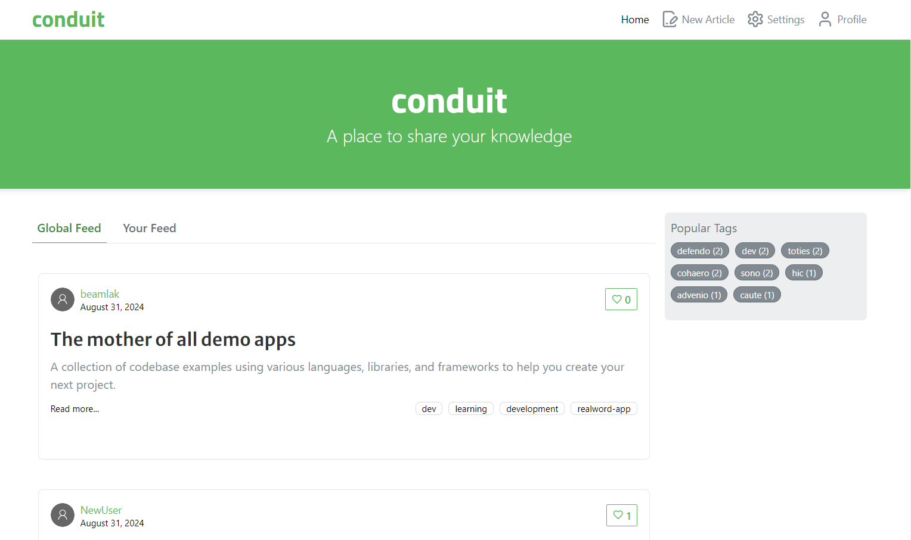

# 

> ### MERN codebase containing real-world examples (CRUD, auth, advanced patterns, etc.) that adheres to the [RealWorld](https://github.com/gothinkster/realworld) spec and API.

### [Demo](https://demo.realworld.io/)&nbsp;&nbsp;&nbsp;&nbsp;[RealWorld](https://github.com/gothinkster/realworld)

This codebase was created to demonstrate a fully-fledged fullstack application built with (Prisma, Express, React, Node.js) including CRUD operations, authentication, routing, pagination, and more.

For more information on how this works with other frontends/backends, head over to the [RealWorld](https://github.com/gothinkster/realworld) repo.

## Table of Contents

-   [Overview](#overview)
-   [Installation](#installation)

<!-- OVERVIEW -->

## Overview



#### Installation:

1.  Clone the repository:

    ```bash
    git clone https://github.com/render217/ShoppifyV2
    ```

2.  Create a .env file in backend/config folder and add the following as key = value

    ```
        PORT=
        JWT_SECRET=
        FRONTEND_URI=
        DATABASE_URL=
    ```

    Create a .env file in frontend directory and add the following as key = value

    ```
      VITE_BACKEND_URL=http://localhost:<PORT>/api

      N.B(PORT => port you used for the backend)
    ```

3.  Navigate into the directory and install dependencies: both in frontend and backend folder

    ```bash
    npm install
    ```

4.  Start the development server: in both client and backend folder
    ```bash
    npm run dev
    ```
